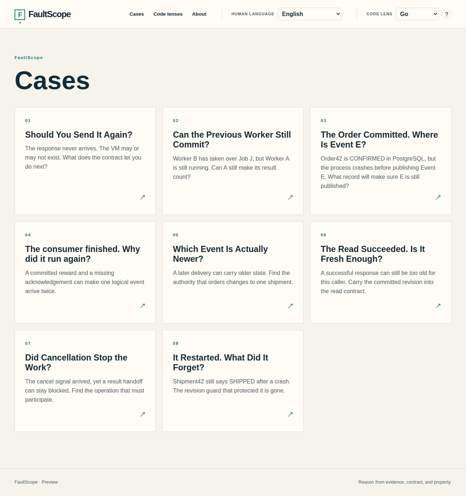

# FaultScope

[English](README.md) · [繁體中文](README.zh-TW.md) · [简体中文](README.zh-CN.md) · [日本語](README.ja.md) · [한국어](README.ko.md) ·
[Español](README.es.md) · [Français](README.fr.md) · [Deutsch](README.de.md) · [Português (Brasil)](README.pt-BR.md) · [Italiano](README.it.md) ·
[Nederlands](README.nl.md) · [Polski](README.pl.md) · [Türkçe](README.tr.md) · [Українська](README.uk.md) · [Русский](README.ru.md) ·
[العربية](README.ar.md) · [हिन्दी](README.hi.md) · [Tiếng Việt](README.vi.md) · [ไทย](README.th.md) · [Bahasa Indonesia](README.id.md)

**Interactive learning lab for distributed application correctness.**

FaultScope helps engineers reason from evidence, contracts, properties, authority, durability, and failure boundaries. Each Case asks what a system actually guarantees before naming a repair pattern.



*The eight published Cases in the English interface.*

## Explore the Cases

1. [Should You Send It Again?](docs/cases/fs-c01.md) — A `CreateVM` request returns no completion response. Decide what a retry can establish.
2. [Can the Old Worker Still Commit?](docs/cases/fs-c02.md) — Worker B takes over, but Worker A may resume. Find where authority to commit must be enforced.
3. [The Database Committed. Where Is the Event?](docs/cases/fs-c03.md) — A database commit survives a crash before broker publication. Find which publication obligation must be durable.
4. [The Consumer Finished. Why Did It Run Again?](docs/cases/fs-c04.md) — A reward commits before ACK, so redelivery can repeat the protected effect. Find the authoritative boundary that stops the second reward.
5. [Which Event Is Actually Newer?](docs/cases/fs-c05.md) — Shipment events arrive out of source order. Use the source-defined per-shipment revision to prevent projection regression.
6. [The Read Succeeded. Is It Fresh Enough?](docs/cases/fs-c06.md) — A verification read may return an older projection after a successful write. Carry the committed revision as the read’s minimum.
7. [Did Cancellation Stop the Work?](docs/cases/fs-c07.md) — A producer can stay blocked on result handoff after cancellation. Make that blocking operation observe the signal.
8. [It Restarted. What Did It Forget?](docs/cases/fs-c08.md) — A durable business value survives a crash while its revision guard disappears. Recover both before accepting events.

Each Case has **Guided**, **Challenge**, and **Deep Dive** modes, a Case-specific visual, an Evidence / Contract / Property rail, a positive control, a remaining failure surface, and seven Code Lenses. Progress is stored per Case in the browser.

Run a released binary with `./faultscope`, or build the current preview:

```bash
go run ./tools build
./dist/faultscope
```

Open [http://localhost:8080/](http://localhost:8080/). The default `:8080` binds all interfaces. Use `./dist/faultscope --listen 127.0.0.1:9000` or `FAULTSCOPE_LISTEN=127.0.0.1:9000 ./dist/faultscope` for a different address; the flag takes precedence. See [getting started](docs/development/getting-started.md) for Node 24, pnpm 12, and source-build setup.

## Current status

This is a **`0.0.x` preview** with eight published Cases. The VM, Job Store, order, broker, and rewards examples are synthetic teaching models, not production SDK clients or infrastructure.

All 20 Human Locales have complete UI and Case 01–08 message catalogs. The 19 non-English catalogs are **unreviewed beta translations**. Human Locale changes the explanation and layout; Code Lens changes the source representation. They are independent: for example, 繁體中文 + Go or العربية + C. The seven Code Lenses are **Go, TypeScript, Python, Java, PHP, C, and C++**.

The Next.js/React frontend is statically exported and embedded in one Go executable. Production needs no Node server, database, content directory, or translation service. Learner progress and preferences live only in the browser.

## Documentation and contributing

Start at the [documentation index](docs/README.md), or choose a path:

- [Case authors](docs/cases/authoring-guide.md)
- [Translation contributors](docs/localization/translation-guide.md)
- [Code Lens contributors](docs/code-lenses/contributing.md)
- [Frontend and Go contributors](docs/development/getting-started.md)
- [Architecture](docs/architecture/overview.md)
- [Contributing guide](CONTRIBUTING.md)

FaultScope is licensed under the [MIT License](LICENSE).
