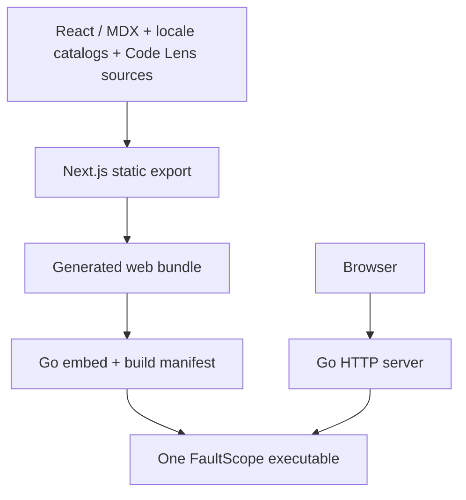

# Architecture overview

FaultScope has a build-time frontend and one production runtime. The web app
is Next.js App Router with React and static export. MDX is configured as a
build-time option; published Case prose uses JSON locale catalogs. Source
examples in `examples/` are extracted by semantic anchor.

At runtime the browser requests HTML and assets from the Go HTTP server.
Interactive Case state, Human Locale preference, and Code Lens preference
remain in browser storage. The server reads only its embedded filesystem.
There is no production Node process, database, runtime content directory,
remote translation service, or external dependency for canonical Cases.

The build validates Case metadata, locale catalogs, and source-region anchors;
exports localized routes; hashes the web bundle; and embeds it into Go.
The separate `check --all` command runs the seven source toolchains and
fixtures. Startup rejects a bundle whose metadata or bytes disagree with the
executable. See [build provenance](build-provenance.md) and the
[build guide](../build/build.md).

The [runtime contract](runtime-contract.md), [routing/SEO](seo-and-routing.md),
and [single-binary rationale](single-binary.md) describe the operational
boundaries.
